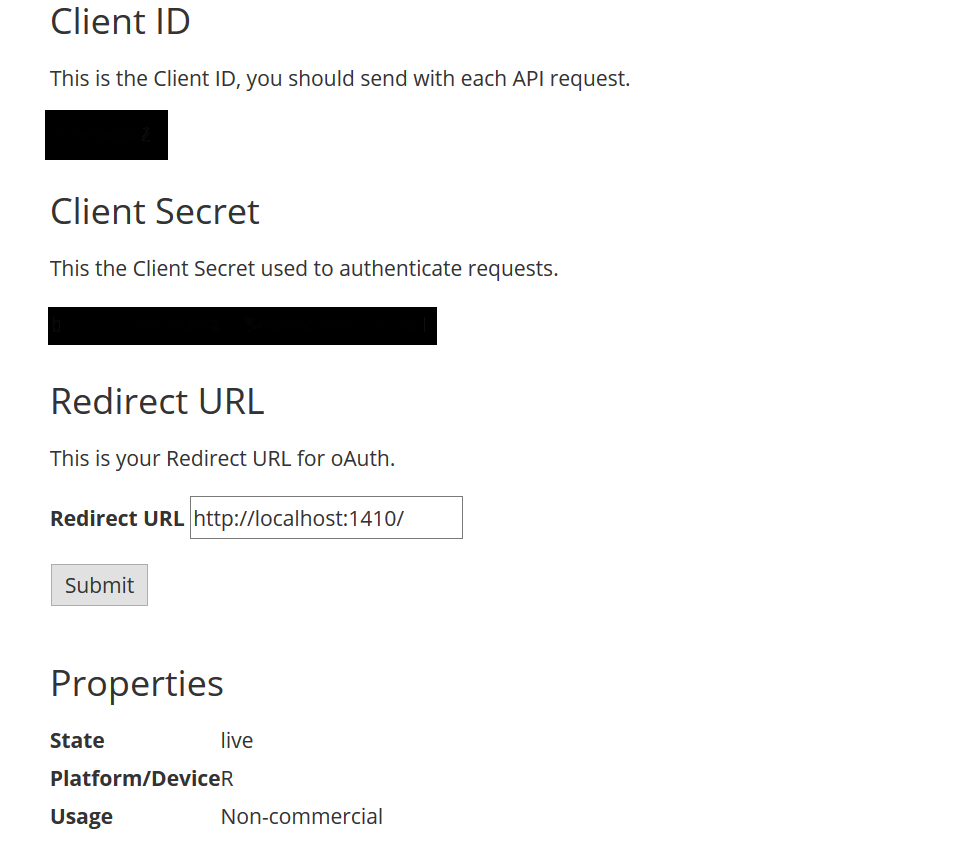

[](https://travis-ci.org/MaxGreil/JamendoR)

JamendoR
========

<!-- README.md is generated from README.Rmd. Please edit that file -->
Overview
--------

JamendoR is a R wrapper for pulling track audio features and other information from Jamendo's Web API. You can pull song and playlist information for a given Jamendo user (including yourself!) or enter an artist's -, album's -, or track's name and retrieve the available information in seconds.

Installation
------------

Development version

``` r
devtools::install_github('MaxGreil/JamendoR')
```

Authentication
--------------

First, set up an account with Jamendo to access their Web API [here](https://devportal.jamendo.com/signup). This will give you your `Client ID` and `Client Secret`. Once you have those, you can pull your access token into R with `jamendoOAuth(app_name)`.

The easiest way to authenticate is to set your credentials to the System Environment variables `JAMENDO_CLIENT_ID` and `JAMENDO_CLIENT_SECRET`. The default arguments to `jamendoOAuth(app_name)` (and all other functions in this package) will refer to those. Alternatively, you can set them manually and make sure to explicitly refer to your access token in each subsequent function call.

``` r
Sys.setenv(JAMENDO_CLIENT_ID = 'xxxxxxxxxxxxxxxxxxxxx')
Sys.setenv(JAMENDO_CLIENT_SECRET = 'xxxxxxxxxxxxxxxxxxxxx')

token <- jamendoOAuth(app_name="xxxx")
filedir <- tempdir()
save(token, file=file.path(filedir, "token"))
```

#### Authorization code flow

For certain functions and applications, you'll need to be logged in. To do this, your Jamendo application needs to have a callback url. You can set this to whatever you want, but a good default option is `http://localhost:1410/` (see image below). For more information on authorization, visit the offical [Jamendo Developer Guide](https://developer.jamendo.com/v3.0/authentication).



Usage
-----

### Get information about a specific user:

``` r
user <- getUserProfile(user_name = "claudod")
#      id dispname lang creationdate
#1 972174  claudod   it   2010-10-17
```

### Search for an artist:

``` r
artists <- getArtistsLocation("GRC", limit=3)
#      id            name                                website   joindate                 shorturl
#1   1510 Judas Priestley      http://myspace.com/judaspriestley 2006-03-21   http://jamen.do/a/1510
#2 338873           nasos                                        2008-03-25 http://jamen.do/a/338873
#3 348714          e.k.m. http://epithesikatametopo.blogspot.com 2009-03-16 http://jamen.do/a/348714
#                              shareurl
#1   http://www.jamendo.com/artist/1510
#2 http://www.jamendo.com/artist/338873
#3 http://www.jamendo.com/artist/348714
```

### Get information about an artist using the artist id:

``` r
artist <- getArtist(artist_id = "1510")
#    id            name                           website   joindate               shorturl
#1 1510 Judas Priestley http://myspace.com/judaspriestley 2006-03-21 http://jamen.do/a/1510
#                            shareurl
#1 http://www.jamendo.com/artist/1510

info <- getArtistMusicinfo(artist_name = "Judas Priestley")
#        tags
#1     glitch
#2 electronic
#3    ambient
```

### Get information about albums available from a specific artist:

``` r
albums <- getArtistAlbums(artist_id = "1510")
#     id                name releasedate                                                         image
#1 14866 Deuteranopia Utopia  2007-12-04 https://imgjam1.jamendo.com/albums/s14/14866/covers/1.200.jpg
```

### Get songs from a specific album:

``` r
tracks <- getAlbumTracks(album_id = "14866")
#      id position           name duration                                     license_ccurl
#1 114069        1 Deuteranopia 0       19 http://creativecommons.org/licenses/by-nc-sa/3.0/
#2 113885        2 Deuteranopia 1      402 http://creativecommons.org/licenses/by-nc-sa/3.0/
#3 114063        3 Deuteranopia 2      416 http://creativecommons.org/licenses/by-nc-sa/3.0/
#4 113926        4 Deuteranopia 3      277 http://creativecommons.org/licenses/by-nc-sa/3.0/
#5 113953        5 Deuteranopia 4      387 http://creativecommons.org/licenses/by-nc-sa/3.0/
#6 114050        6 Deuteranopia 6      323 http://creativecommons.org/licenses/by-nc-sa/3.0/
#7 114067        7 Deuteranopia 7      384 http://creativecommons.org/licenses/by-nc-sa/3.0/
#8 114052        8 Deuteranopia 8       93 http://creativecommons.org/licenses/by-nc-sa/3.0/
#                                                                   audio
#1 https://mp3l.jamendo.com/?trackid=114069&format=mp31&from=app-77b5b682
#2 https://mp3l.jamendo.com/?trackid=113885&format=mp31&from=app-77b5b682
#3 https://mp3l.jamendo.com/?trackid=114063&format=mp31&from=app-77b5b682
#4 https://mp3l.jamendo.com/?trackid=113926&format=mp31&from=app-77b5b682
#5 https://mp3l.jamendo.com/?trackid=113953&format=mp31&from=app-77b5b682
#6 https://mp3l.jamendo.com/?trackid=114050&format=mp31&from=app-77b5b682
#7 https://mp3l.jamendo.com/?trackid=114067&format=mp31&from=app-77b5b682
#8 https://mp3l.jamendo.com/?trackid=114052&format=mp31&from=app-77b5b682
#                                         audiodownload
#1 https://mp3d.jamendo.com/download/track/114069/mp32/
#2 https://mp3d.jamendo.com/download/track/113885/mp32/
#3 https://mp3d.jamendo.com/download/track/114063/mp32/
#4 https://mp3d.jamendo.com/download/track/113926/mp32/
#5 https://mp3d.jamendo.com/download/track/113953/mp32/
#6 https://mp3d.jamendo.com/download/track/114050/mp32/
#7 https://mp3d.jamendo.com/download/track/114067/mp32/
#8 https://mp3d.jamendo.com/download/track/114052/mp32/

info <- getAlbumMusicinfo(album_id = "14866")
#      tags
#1   glitch
#2  ambient
#3  triphop
#4 peaceful

ids <- tracks$id
reviews <- getReviewsTracks(ids)
# NULL
```

### Get information about a specific song:

``` r
track <- getTrack(track_name = "Deuteranopia 0")
#      id           name duration artist_id     artist_name          album_name album_id
#1 114069 Deuteranopia 0       19      1510 Judas Priestley Deuteranopia Utopia    14866
#                                      license_ccurl position releasedate
#1 http://creativecommons.org/licenses/by-nc-sa/3.0/        1  2007-12-04
#                                                                   audio
#1 https://mp3l.jamendo.com/?trackid=114069&format=mp31&from=app-77b5b682
#                                         audiodownload prourl                 shorturl
#1 https://mp3d.jamendo.com/download/track/114069/mp32/        http://jamen.do/t/114069
#                             shareurl
#1 http://www.jamendo.com/track/114069
```

### Search Jamendo database for playlists with certain name:

``` r
playlists <- getPlaylistsNamesearch("chill", limit = 3)
#         id                      name creationdate user_id                        user_name
#1 100086550 Ambiente, Lunge, Chillout   2014-12-03 4014817 mundofascinante.viajes@gmail.com
#2    100268                   Chillin   2009-01-19  555416                         jdhall75
#3    100276                  chillout   2009-01-19   69982                           sleeva
#                                                 zip                     shorturl
#1 https://mp3d.jamendo.com/download/p100086550/mp32/ http://jamen.do/l/p100086550
#2    https://mp3d.jamendo.com/download/p100268/mp32/    http://jamen.do/l/p100268
#3    https://mp3d.jamendo.com/download/p100276/mp32/    http://jamen.do/l/p100276
#                                shareurl
#1 http://www.jamendo.com/list/p100086550
#2    http://www.jamendo.com/list/p100268
#3    http://www.jamendo.com/list/p100276
```
